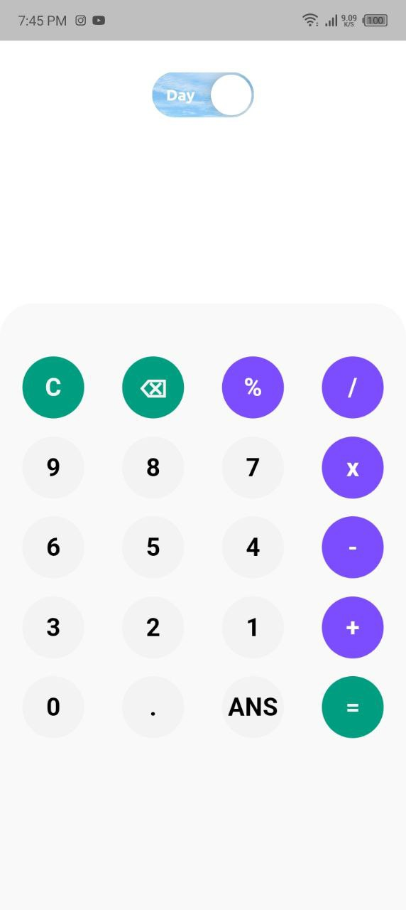
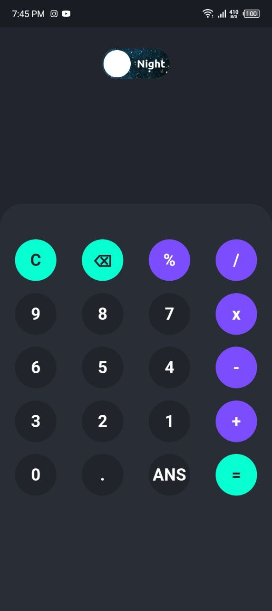

# Lion Calculator

This project is a cross-platform calculator, although it currently only works well on Android. I don't think it can replace the calculator on your phone, but it can be a good example of how to create flutter applications due to its good design.

## Preview

